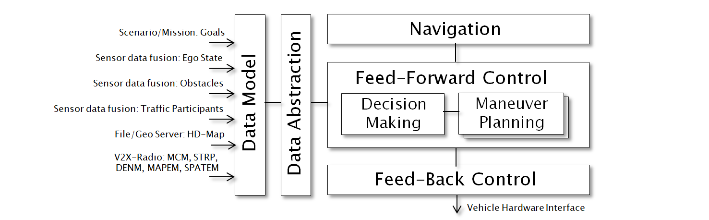

<!--
********************************************************************************
* Copyright (C) 2017-2020 German Aerospace Center (DLR). 
* Eclipse ADORe, Automated Driving Open Research https://eclipse.org/adore
*
* This program and the accompanying materials are made available under the 
* terms of the Eclipse Public License 2.0 which is available at
* http://www.eclipse.org/legal/epl-2.0.
*
* SPDX-License-Identifier: EPL-2.0 
*
* Contributors: 
*   Daniel Heß 
********************************************************************************
-->

# Automated Driving Open Research (ADORe)
Eclipse ADORe is a modular software library and toolkit for decision making, planning, control and simulation of automated vehicles:
- Algorithms and data models applied in real automated driving system for motion planning and control
- Mechanisms for safe interaction with other CAVs, infrastructure, traffic management, interactions with human-driven vehicles, bicyclists, pedestrians
- Evaluation in context of overall traffic system using [SUMO](https://github.com/eclipse/sumo)
- Software quality, reliability and TRL as required for *research projects and prototypes*

For a quick overview, please follow [installation instructions](documentation/installation.md) and have a look at the [demo scenarios](adore_if_ros_demos).

Features:
- High-definition road-map representation and loading from [OpenDrive](https://www.asam.net/standards/detail/opendrive/) and [Road2Simulation](https://www.dlr.de/ts/desktopdefault.aspx/tabid-11648/20367_read-46771/)
- Planning and control modules for smooth "in-lane" driving, (cooperative) lane changes and emergency maneuvers
- Data models for automation-internal scene understanding, environment models as well as data abstraction layers for decoupling of planning algorithms and environment models
- Cooperative vehicle behavior using Vehicle-to-X (V2X) radio communication based on [ETSI ITS-G5](https://www.etsi.org/committee/1402-its) 
- Interface for co-simulation with Eclipse SUMO: Simulation of traffic and infrastructure around automated vehicle
- Interface to [ROS](http://wiki.ros.org/noetic) (Robot Operating System)  

## Getting started
- [Installation](documentation/installation.md)
- [Executable ROS demo scenarios](adore_if_ros_demos)

## Overview
- [libadore](libadore): System-independent library for automated driving functionality.
- [adore_if_ros](adore_if_ros): ROS interface package for ADORe. Uses ROS nodes to run and interconnect applications defined in libadore.
- [adore_if_ros_msg](adore_if_ros_msg): ROS message definitions for data exchange inside an automated vehicle as well as between different automated vehicles in a simulation setup.
- [adore_if_ros_demos](adore_if_ros_demos): ROS launch files for simulation examples.
- [keepmoving_if_ros](keepmoving_if_ros): REST (json) based mission specification for vehicle
- [sumo_if_ros](sumo_if_ros): ROS interface package for SUMO. Allows to combine ADORe automated vehicles and SUMO traffic and infrastructure simulation.
- [v2x_if_ros](v2x_if_ros): Vehicle-to-X interface packge defining ROS message equivalents for radio communication. 
- [adore_if_v2x](adore_if_v2x): ADORe interface package, which converts V2X messages into ADORe internal data formats.
traffic in a ROS-based simulation.
- [plotlab](plotlab): System-independent plotting.

## Approach
The Eclipse ADORe project is intended as a modular library, enabling construction of vehicle automation systems according to different paradigms. An exemplary approach based on three control layers "navigation", "feed-forward control" and "feed-back control" is taken to create executable demonstrations. The system's inputs include mission goals, contemporary state information derived from sensor data, a-priori information in the form of static hd-maps and radio-based (ITS-G5), direct communication with other traffic elements. The system's output (steering angle, acceleration, brake, etc.) is adressing the physical vehicle's actuator interface, usually provided by OEMs.

## Further information
- The current current development state is documented in the [changelog](changelog.md)
- The source code and the accompanying material is licensed under the terms of the [EPL v2](LICENSE).
- The source code depends on external software packages, which are listed in [dependencies](dependencies.md).
- If you want to get involved, please see [contribution guidelines](CONTRIBUTING.md) and [style guide](documentation/styleguide.md).

## Disclaimer
The views, opinions as well as technical preferences expressed in the source code and its documentation are those of the authors and do not necessarily reflect the official policy or position of their employer.
The technical progress of this open source project is not representative of the DLR-TS closed source development line. 
Some modules cannot be published, due to project funding agreements, commercial licenses and/or dependencies on other closed source modules.
The source code and the accompanying materials are provided without warranty or implication of technical correctness, as governed by [license](LICENSE).
We do not recommend application of the provided source code or material in any kind of safety critical task.

## Contributors
Daniel Heß, Stephan Lapoehn, Thomas Lobig, Matthias Nichting, Robert Markowski, Jan Lauermann, Reza Deriani, Jonas Rieck, Maximiliano Bottazzi, Maik Bargmann, Eric Neidhardt

Our thanks to former contributors: Jörg Belz, Christian Löper
