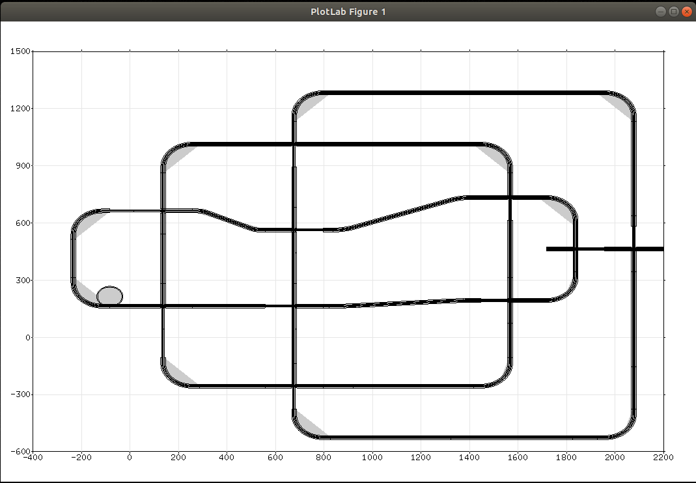
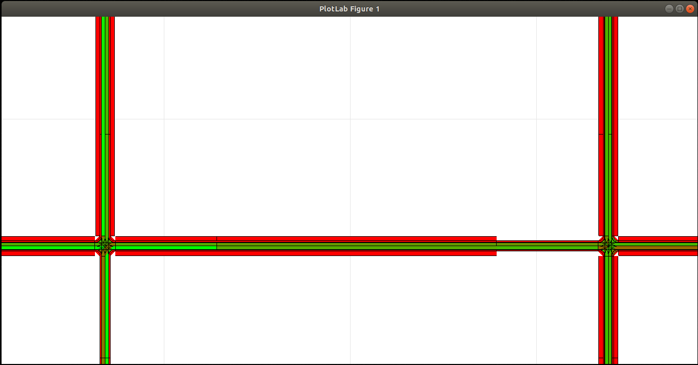
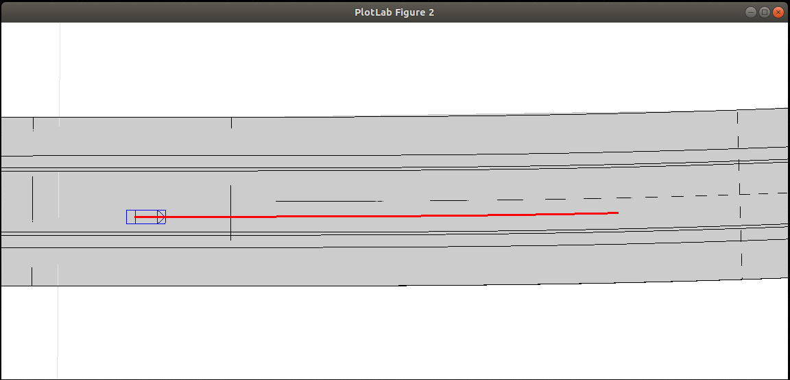
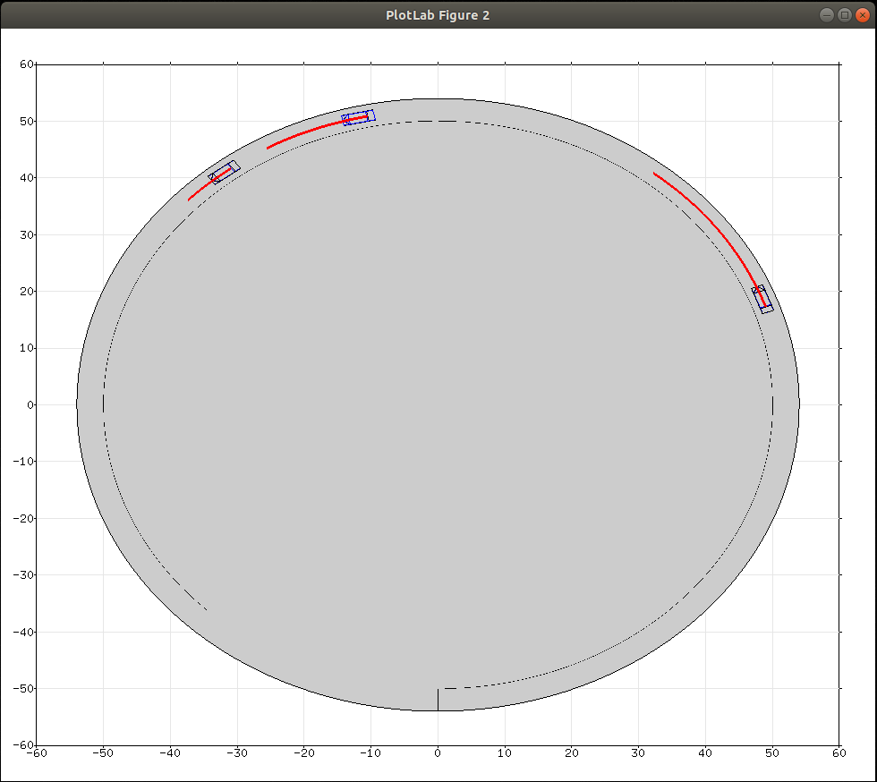
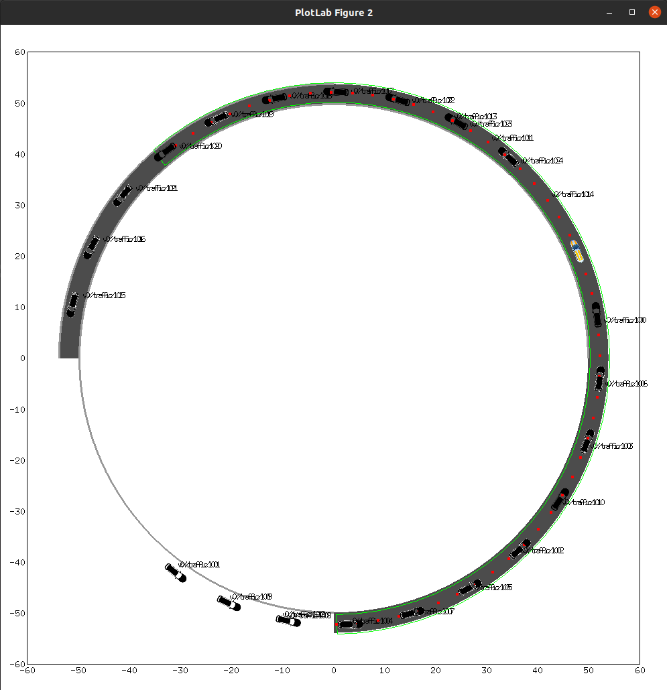
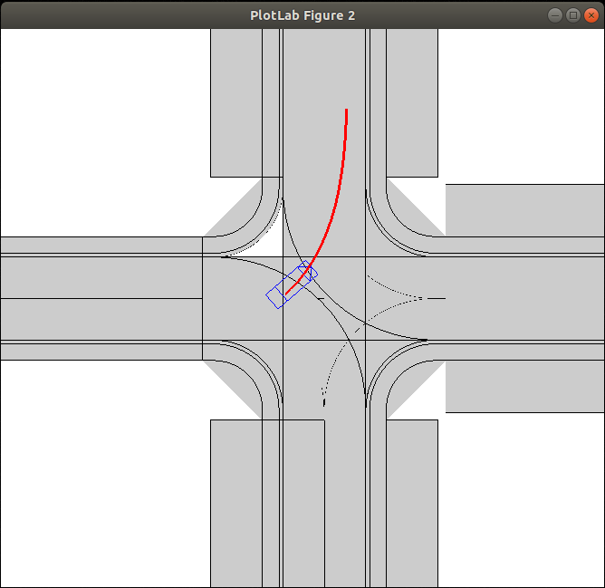

<!--
********************************************************************************
* Copyright (C) 2017-2020 German Aerospace Center (DLR). 
* Eclipse ADORe, Automated Driving Open Research https://eclipse.org/adore
*
* This program and the accompanying materials are made available under the 
* terms of the Eclipse Public License 2.0 which is available at
* http://www.eclipse.org/legal/epl-2.0.
*
* SPDX-License-Identifier: EPL-2.0 
*
* Contributors: 
*   Daniel Heß - initial API and implementation
********************************************************************************
-->
# ADORe ROS Demos
In the following, several demonstrations are given to showcase technical solutions on reduced examples.
Their goal is to serve as venture points for setting up simulation experiments with ADORe automated vehicles.
To start the demonstrations on your computer, first compile ADORe and its ROS interface, start the plotting server and navigate to the demo folder:
~~~bash
cd ~/catkin_ws/src/adore
catkin build adore_if_ros
cd plotlabserver
./start.sh
cd ../adore_if_ros_demos
~~~
After compilation is successful, a demo is started by executig "roslaunch _demo_file_name_".

 
## How to load Open Drive tracks
- file: [demo001_loadmap.launch](demo001_loadmap.launch) 
- The ROS node "adore_mapprovider_node" is responsible for loading tracks, aka. roadmaps.
- Track files are specified by the local ROS parameter "PARAM/track". ("local" as in "can be defined separately for each vehicle/agent in their respective namespace")
- Multiple tracks may be loaded: File names have to be separated by ";" in the "PARAM/track" string. 
- Loading multiple tracks results in a conjunction of elements from all tracks. If road elements of different tracks are geometrically adjacent, the automation system will be able to transition between them. 
- An offset may be specified for OpenDrive maps:
	- Append ",transform" to an OpenDrive file name specified in "PARAM/track"
	- Define west="x" and south="y" (lower left corner) in the header element of the OpenDrive xml file
	- All elements of the file will then be shifted by (x,y)
- The "adore_mapprovider_node" dissects the roadmap representation into lane- or road-border segments, of type "adore::env::borderbased::Border" 
- Each "Border" keeps track of its marking and of the lane type between itself and its left neighbor
- Typically an automated vehicle is allowed to drive between two Borders, which enclose a lane of type "Driving"
- To prevent the automation system's maneuver planner from having to deal with the complete map at once, the mapprovider will send "Borders" in the vicinity of the vehicle via the rostopic "ENV/Border". 
	- See also: The ros topic and message type documentation [adore_if_ros_msg/Readme.md](../adore_if_ros_msg/README.md)
	- The distance at which "Border" objects become visible is controlled by the parameter "PARAMS/map_provider/r"
- If the parameter "PARAMS/map_provider/activate_plotting" is set to "true", the overall map will be displayed in figure 1 

Overview plot of tracks loaded by demo001:

## Computation of a navigation function
- file: [demo002_navigatemap.launch](demo002_navigatemap.launch)
- The ROS node "adore_navigation_node" helps an ADORe automated vehicle to navigate to its destination.
- A destination for the automated vehicle may be set, by sending a "NavigationGoal" message on the topic "ENV/NavigationGoal"
- Similar to the "adore_mapprovider_node", tracks specified in "PARAMS/track" are loaded into memory
- When such a "NavigationGoal" message is received, the distance along the road network towards the destination is computed for each "Border" object in memory
- Based on the same ideas of locality as the "adore_mapprovider_node", the "adore_navigation_node" sends distance values for each "Border" object in the vicinity of the vehicle on the ROS topic "ENV/NavigationData".
- If the parameter "PARAMS/navigation/active_plotting_global" is set to true, the navigation function will be shown color-coded for the overall map in figure 1. (Red is far, and green is near. Please note: In the example below, non-drivable sidewalks are color-coded red at "infinite" cost.)

Color-coded navigation function plotted by demo002:

## Simulation of Automated Lane Following
- file: [demo003_lanefollowing.launch](demo003_lanefollowing.launch)
- Demo 003 shows how to simulated an automated vehicle with a minimal set of components. Several nodes are introduced in addition to the "adore_mapprovider_node" described above.
- To create a dynamic simulation, the ROS node "adore_timer_node" publishes a globally synchronous time signal on the topic "/SIM/utc". The process is started in a shell, in order to accept user input: By pressing enter, the simulation can be paused and resumed.
- The namespace "SIM" is here reserved for simulation information, e.g. global, synchronous, precise states accessible to simulation modules. 
- Topics under "SIM" can generally only be accessed by simulation nodes and never by "production" nodes. Simulation nodes, such as sensor models, vehicle models, network models etc. relay the information to sensor- and environment information topics of a specific agent/vehicle.
- In its most basic form, the "adore_vehiclemodel_node" serves both as a vehicle model and an idealized vehicle state sensor: It receives the time signal "/SIM/utc" and the vehicle control inputs "FUN/MotionCommand/steeringAngle" and "FUN/MotionCommand/acceleration" and integrates the vehicle state up to the most recent time value. This vehicle state is published on the topic "/_agentnamespace_/odom". (Note: In order to insert an error model for the state measurement, the output topic of "adore_vehicle_model" could be re-routed to an error-model node by declarations in the launch file.)
    - In order to set initial conditions for simulations, the state of the vehicle can be reset by sending messages on the topics "SIM/ResetVehiclePose" and "SIM/ResetVehicleTwist".
    - The state of the vehicle is always maintained for the center of the rear axle.
    - The "adore_vehiclemodel_node" also publishes its state information on the simulation topic "/SIM/traffic". In following exapmles, the topic is used to exchange state information between multiple, simulated agents/vehicles. A parameter "_agentnamespace_/simulationID" is introduced. This unique id is attached to the state information published on "/SIM/traffic", to discriminate between different agents during simulation.
- The "production" part of the automated lane following system consists of two control nodes in this example: A feed-forward motion planner running at 10 Hz and a stabilizing feed-back controller running at 100Hz.
    - The motion planner "adore_lfbehavior_node" generates trajectories for lane-following only. It receives "road marking information" on the topic "ENV/Border" from the "adore_mapprovider_node" and ego state information on the "odom" topic. It computes a reference trajectory consisting of desired vehicle states and feed-forward control inputs. (Desired states are given for the center of rear axle). The reference trajectories are published on the topic "FUN/SetPointRequest".
    - The feed-back controller receives the reference trajectories and the current vehicle state and computes and publishes a control input signal ("FUN/MotionCommand/steeringAngle" and "FUN/MotionCommand/acceleration") with the goal of minimizing the distance between actual vehicle state and current reference vehicle state.
- The process "adore_borderbird_node" plots a simplistic representation of the local scene from a "birds-eye" perspective: The local "road marking information", the reference trajectory (displayed in red) and the current vehicle state (blue box with triangle).

Local scene for lane following automation in demo003:

## Lane following with three automated vehicles
- file: [demo004_follow_vehicle_mult.launch](demo004_follow_vehicle_mult.launch)
- In order to simulate multiple vehicles, multiple instances of "adore_vehiclemodel_node", "adore_mapprovider_node",  "adore_feedbackcontroller_node" and "adore_lfbehavior_node" have to be started.
    - Note: Each set of nodes is started in a separate namespace, e.g. "/vehicle0", "/vehicle1" and "/vehicle2"
- A simple sensor model is introduced, which allows a vehicle to detect positions of other vehicles: 
    - For each vehicle, an "adore_objectdetectionmodel_node" reads state information of traffic participants from the topic "/SIM/traffic" and "/SIM/traffic/agg". This information is published on the vehicle internal topic "/_agentnamespace_/traffic". 
    - The topic "/SIM/traffic" publishes individual state updates. On the topic "/SIM/traffic/agg", aggregate information in the form of multiple vehicle states per message is published. 
    - The "sensor modeling" part of the simple node is actually a range limit for detections.
    - Detections of other traffic participants are colored black in the figure 2 plot.
- Each vehicle can be parameterized independently in its namespace: The global speed limit of vehicle2, "/vehicle2/PARAMS/tactical_planner/global_speed_limit", is set to a small value in the launch file. This will result in vehicle 0 and 1 catching up  and following.
    - Note: The parameter can be manipulated during simulation with the shell command "rosparam set /vehicle2/PARAMS/tactical_planner/global_speed_limit 10". Of course, other parameters can also be changed during simulation.

Two fast vehicles following a slow vehicle in demo004:

## Lane following with ADORe automated vehicle and multiple SUMO vehicles
- file: [demo005_follow_vehicle_sumo.launch](demo005_follow_vehicle_sumo.launch) 
- [SUMO](http://eclipse.org/sumo)  is a free and open traffic simulation toolsuite. It is used in this example to represent manually driven vehicles in the vicinity of the ADORe automated vehicle.
- SUMO has to be downloaded and installed. These steps will be executed by the cmake script of the SUMO-ROS interface "sumo_if_ros".  So before launching the demonstration, make sure to execute:
~~~bash
cd ~/catkin_ws/src/adore
catkin build sumo_if_ros
export SUMO_HOME=~/catkin_ws/src/adore/sumo
~~~
- The demo005 launch file starts a SUMO simulation. Parameters include SUMO simulation setup, (here: demo005.sumocfg), as well as a simulation step size.
- The node "sumotraffic2ros_node" uses SUMO's [TraCI](https://sumo.dlr.de/docs/TraCI.html) interface to synchronize simulation time and to exchange traffic participant state information.
    - On changes of the time signal "/SIM/utc" the SUMO simulation is advanced.
    - Traffic information from the topic "/SIM/traffic" is pusblised to SUMO, so that SUMO vehicles may react to ADORe vehicles.
    - Traffic information from SUMO is published on the "/SIM/traffic/agg".
- In this example, a single ADORe vehicle instance is created in addition to the SUMO traffic.
- NOTE: The timer is started in "paused" state, to allow startup of all process before simulation begins. Visual output will only be generated as soon as time advances, so make sure to "unpause" the timer node.

Several SUMO vehicles and one ADORe automated vehicle in demo005:

## Lane following and navigation to a goal location
- file: [demo006_lanefollowing_navigation.launch](demo006_lanefollowing_navigation.launch)
- Demo006 showcases a vehicle automatically driving to a given goal position. The setup is similar to demo003, yet a "adore_navigation_node" is additionally started.
- The launch file sets an initial NavigationGoal. During simulation, the goal point can be changed by publishing a ROS message. For example with the following shell command:
~~~bash
rostopic pub /vehicle0/ENV/NavigationGoal adore_if_ros_msg/NavigationGoal '{target: {x: 360, y: 162, z: 0}}'
~~~ 
- As a reaction, the navigation function should be re-computed and the vehicle should change its course to drive to the new location.
- Note: Currently, the vehicle stops at the end of a "Border", which has minimum distance to the navigation goal. 
- NOTE: The timer is started in "paused" state, to allow startup of all process before simulation begins. Visual output will only be generated as soon as time advances, so make sure to "unpause" the timer node.

Vehicle turning at intersection and stopping at goal in demo006:

