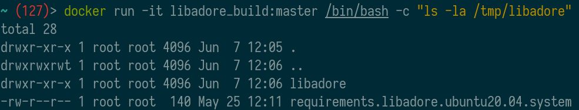

# ADORe Build System

The ADORe build system is a docker build and runtime  environment for ADORe.

## Background
Although ADORe is primarily centered around ROS there is also stand-alone 
components in a conglomeration of technologies such as python, C++ and others.
Each component could have their own respective build and run steps. The primary 
aim of the build system is to normalize complex build processes, as well as, 
provide a containerized runtime for these processes with a focus of 
configuration management of dependencies and software reuse.

## Build interface normalization
The ADORe build system aims to provide per module predictable building and 
testing interfaces via GNU Make such as: 'make build' 'make test' and more.

GNU Make is not a new tool however it is stable and familiar to many developers.
For this reason it was selected as the centralized "glue" for the ADORe build
system. GNU Make offers "documentation-as-code" for ADORe capturing complex 
build, testing, and execution processes, steps, and commands into a single 
location. To discover the capabilities of a given module, or what a module can 
do, simple inspect the provided Makefile. It is up to the developer of a module 
to provide interesting or relevant targets for the project or module. At minimum
'make build', 'make test' and 'make clean' should be provided by a module. 
Review the [modules](#modules) section for more detail on what constitutes a 
module.

## Dependency configuration management
In a standard Dockerfile it can be difficult to manage or version system 
dependencies because system dependencies are globed together often on one line. 
The following is a typical example that could be  found in a Dockerfile for 
installing system dependencies following docker "best practices":
```Dockerfile
...
RUN apt-get update && apt-get install -y a b c && \
    rm -rf /var/lib/apt/lists/*
...
```
The problem with this is dependencies tend to change while the build procedure 
may not. In this previous example the dependencies namely a, b, and c are all 
grouped on one line. This makes updating, versioning, tracking/documenting \
(where did the dependency come from or what needs it), and composing dependencies
difficult.

The next example used throughout the ADORe build system adds complexity but also 
has a number of distinct benefits:
```Dockerfile
...
ARG REQUIREMENTS_FILE
...
RUN apt-get update && \
    apt-get install --no-install-recommends -y $(sed '/^#/d' ${REQUIREMENTS_FILE} | sed '/^$/d') && \
    rm -rf /var/lib/apt/lists/*
...
```
The previous example provides the following benefits:
- Dependencies can be tracked in an independent file such as in the case with
adore_if_ros_msg: requirements.adore_if_ros_msg.ubuntu20.04.system
If the base system is changed or upgraded then all that needs to be updated is 
the dependency file.
- There is one dependency per line making visioning easy
- Discovering dependencies within the system is easy
With the following shell command run on the top level of the ADORe project
all dependencies within the project can be discovered: `find -name "requirements.*.ubuntu20.04.system"`
- Composition of dependencies becomes trivial
Building up new docker contexts that pull in dependencies from other modules is 
possible because the dependency files are separate
- Using sed to filter the dependency file allows the use of "#" comments within 
the file. This is useful to documenting/commenting and managing individual 
dependencies.

In general there will be a `files/requirements.<module>.<base system>.system` 
file that contains all necessary dependencies for that module for example: 
"requirements.adore_if_ros_msg.ubuntu20.04.system" which is the system 
dependency file for adore_if_ros_msg.  Furthermore, the system dependency files 
can be segregated into separate files based off of life-cycle context such as 
build dependencies and run dependencies. This is true for modules such as 
libadore which have a build requirements file and a runtime requirements file. 
Although, it is not strictly essential to separate build and runtime system 
dependencies it makes management and composition of dependencies easier.

## Modules
ADORe relies heavily on git submodules for code reuse and boundaries. 
- In general every directory is a module and potentially a stand-alone project
- Every module will provide a Makefile and a Dockerfile 
- Every module will have at minimum a 'build' and 'clean' make target


### Artifacts
Every module will generate artifacts in some form during their respective
life-cycles. This section will detail the possible artifacts.

#### Build artifacts
Every module that produces build artifacts follows the same basic pattern. All 
build artifacts generated by 'make build' will generate a build directory with 
the following path: `<repository name>/<module name>/build`
This could contain binaries, cmake install prefix, headers, Debian packages 
et cetera. 

#### Docker images
In general every module will produce at least a build docker image. If a module
requires a runtime context or other contexts these will be generated as well.
For example on the module libadore located at https://github.com/DLR-TS/
produces the following images:


In the case of libadore there is a docker context for build with will contain
only the build artifacts, a test context which can be used to execute unit tests
and the main context. What docker images/contexts are produced with make build
are dependent on the module needs.

The internal file system layout for each module will be the same and follow the
same pattern.  All project files will be placed in /tmp/<module name>

In the case of project containing ROS packages the structure will be: 
`/tmp/<module name>/<module name>` where the first directory contains the docker
context with Makefile and requirements file and the second directory with the 
same module name will be a standard ROS package with a CMakeLists.txt,
package.xml and any other necessary files. Running 'ls' on the /tmp/libadore 
directory within the libadore build context yields this familiar structure:


#### Log artifacts
Some modules produce log output during various life cycle phases for example
during build, test, or execution. This log output will be placed in the 
following path: `<repository name>/.log/`.
Which logs a module generates is wholly dependent on the module in question.
For more information on this please refer to individual documentation within 
a module.

### Module anatomy
The following section will detail the basic anatomy of a module. At minimum 
every module will have a Makefile and a Dockerfile

#### Makefile
At minimum every module should have a Makefile with 'build' and clean 'targets'
defined. The Makefile provides "documentation-as-code" so if you are wondering
what capabilities a module offers the first place to look is the Makefile. 

The makefile also provides important environmental variables for docker build
and docker run such as a docker tag and potentially other important 
environmental variables relevant to the module.

In general every module should provide a `make help` target to guild users on 
module capabilities. The 'help' target used throughout the ADORe ecosystem is a
spin on the following git gist: https://gist.github.com/prwhite/8168133 and is 
provided by the make_gadgets project at: https://github.com/DLR-TS/make_gadgets.
Any Makefile that has `include make_gadgets/make_gadgets.mk` will have a 
`make help` target. 

Any target or recipe that has two hash symbols such as the following example
Makefile:

```Makefile
include make_gadgets/make_gadgets.mk

.PHONY: test_target
test_target: ## this is a test target
        echo "Hello, World!"
```

will output the comment and target name with the invocation of `make help`. 
Calling `make help` on the previous example Makefile would then yield the 
following:


As can be seen in the previous image the make_gadgets project also provides
another very important recipe/target that is used throughout the ADORe 
ecosystem specifically the "get_sanitized_branch_name". Calling this target 
returns the branch name or hash that has been sanitized such that it can be 
used as a docker image tag. This will be further detailed in a later section.

For more information on how the help target works please review the 
documentation for
https://github.com/DLR-TS/make_gadgets or the gist at 
https://gist.github.com/prwhite/8168133

The Makefile provides the primary means to interact with a module directly by 
navigating to a module and running make commands on the module. 


#### Dockerfile
The Dockerfile is pretty self-explanatory and in general every module will have
a Dockerfile in its root. More dockerfiles may be provided by a module if 
necessary depending if the module also requires runtime context. If there are
many docker files within a module then they can be organized in a subdirectory 
called 'docker'. GNU Make is used primarily to invoke `docker` or 
`docker compose` within ADORe.

#### Interface makefile <module name>.mk
Many modules within ADORe have two makefiles namely 'Makefile' and 
'<module name>.mk'. The first makefile ('Makefile') allows make commands to be
run directly on the module by navigating to the module directory in a shell and
running for example `make build` or `make clean`. 

The second makefile having the same name of the module itself (for example in 
adore_if_ros_msg: adore_if_ros_msg.mk) acts as the external interface for the 
module.  The basic question for this makefile is what behavior, context, and 
environmental variables should be exported from the module.  
This makefile will include the following:
- Important environmental variables for the module (such as docker tag) 
- All the necessary make includes (does the module depend on other modules?)
- All targets that should be externally visible to downstream projects

The self-named makefile included in each module is the external interface for
the module. 

Take this minimal example makefile which includes adore_if_ros_msg.mk:
```Makefile
include make_gadgets/make_gadgets.mk
include adore_if_ros_msg/adore_if_ros_msg.mk

.PHONY: test_target
test_target: ## this is a test target
        echo "Hello, World!"
```

By including adore_if_ros_msg.mk all of the exported targets are now available.
Calling `make help` now on this example Makefile yields the following output:


This allows composition of modules.

The self-named makefile previous discussed also provides a number of important 
dynamic environmental variables which follow the basic form: 
```text
<module name>_PROJECT
<module name>_MAKEFILE_PATH
<module name>_SUBMODULES_PATH
<module name>_TAG
<module name>_IMAGE
```

For example in the module adore_if_ros_msg the following environmental variables
are provided:
```text
ADORE_IF_ROS_MSG_IMAGE= ${ADORE_IF_ROS_MSG_PROJECT}:${ADORE_IF_ROS_MSG_TAG}
ADORE_IF_ROS_MSG_MAKEFILE_PATH= /home/akoerner/repos/csa/github.com/eclipse/test/adore_if_ros_msg
ADORE_IF_ROS_MSG_PROJECT= adore_if_ros_msg
ADORE_IF_ROS_MSG_SUBMODULES_PATH= /home/akoerner/repos/csa/github.com/eclipse/test/adore_if_ros_msg
ADORE_IF_ROS_MSG_TAG= master
```

The environmental variables that a module provides is up to the module author 
but the previously detailed variables are common.  The most important variable 
being the `<module name>_IMAGE`, `<module name>_PROJECT`, and 
`<module name>_TAG` variables which are all relevant for docker image building 
and tagging. 

#### 'files' directory
By convention most modules include a 'files' directory this files directory
contains any context that should be included during build using the docker 
`COPY` key word such as entry point shell scripts, requirements files et cetera.

### Module Composition
The ADORe build system offers two methods of module composition which will be
detailed below. 

#### Hierarchic Composition
In general a module only has visibility into the contents within said module.
This allows modules to be cloned and operated on in complete isolation to
parent context. This is useful for building up complex CI processes. The
following image illustrates the concept:


A give module will have all necessary dependencies within it's tree. Any node
within the tree can be cloned, built and tested in isolation. This requires
recursive cloning; here is an example of adore_if_ros_msg being cloned, built
and tested: 
```bash
git clone git clone --recursive -j8 git@github.com:DLR-TS/adore_if_ros_msg.git
cd adore_if_ros_msg
make build
make test
```
Hierarchic composition has a number of benefits but also carries significant
drawbacks. Development can be cumbersome because every reference to a module
within a project then needs to be updated with any change. 

#### Open Composition
To address the previously discussed drawback of hierarchic module composition 
open module composition is also supported within the ADORe ecosystem. This
allows all modules to be placed in a flat directory structure. The pitfall being
that all required modules must be present in this directory structure otherwise
Make operations will fail.

The following image illustrates the concept of open module composition:


Open module composition is achieved by introducing the `SUBMODULES_PATH`
environmental variable. This must be defined either by the current environment
or by a parent Makefile when invoking a make action on a module. 

If the `SUBMODULES_PATH` variable is not defined and a give module has not been
recursively cloned running any make target on a submodule/module will yield the
following error:
```bash
adore_if_ros_msg(e9019d5) (2)> make help 
INFO: To clone submodules use: 'git submodules update --init --recursive'
INFO: To specify alternative path for submodules use: SUBMODULES_PATH="<path to submodules>" make build'
INFO: Default submodule path is: /home/akoerner/repos/csa/github.com/eclipse/adore/adore_if_ros_msg'
adore_if_ros_msg.mk:21: *** "ERROR: /home/akoerner/repos/csa/github.com/eclipse/adore/adore_if_ros_msg/make_gadgets 
does not exist. Did you clone the submodules?".  Stop.
```
To avoid this error the `SUBMODULES_PATH` environmental variable has to be
sourced.
